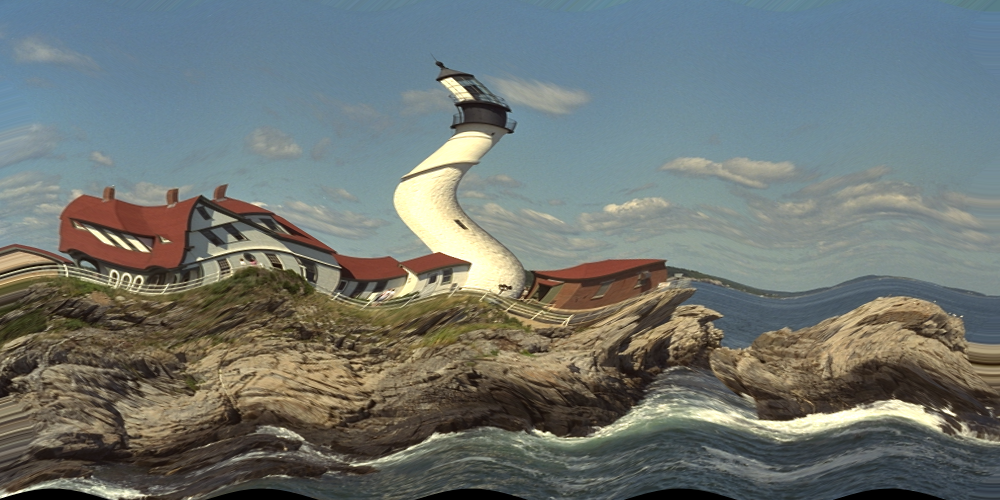

# CuTextures

*CUDA textures ("CUDA arrays") interface for native Julia*

**DEPRECATED: This packaged was improved and merged into [CUDA.jl](https://github.com/JuliaGPU/CUDA.jl)**

CUDA Textures are handled though two main types, `CuTextureArray` and `CuTexture`.

`CuTextureArray` is a type to handle CUDA arrays: opaque device memory buffers optimized for texture fetching.
The only way to initialize the content of these objects is by copying from host or device arrays using the constructor or `copyto!` calls.

`CuTexture` is a type to handle CUDA texture objects. These objects do not hold data by themselves,
but instead are bound either to `CuTextureArray`s (CUDA arrays) or to `CuArray`s (device linear memory). `CuArray`s must have the memory well aligned (good pitch) for correct wrapping.

`CuTexture` objects are meant to be used to do texture fetching inside *CUDAnative.jl* kernels.
When passed to *CUDAnative.jl* kernels, `CuTexture` objects are transformed into lightweight `CuDeviceTexture` objects.
Fetching (sampling) to textures from within the kernels can then be done through indexing operations on the `CuTexture`/`CuDeviceTexture` objects, like `interpolatedval = sometexture2d[0.2f0, 0.9f0]`.

CUDA textures elements are limited to a set of supported primitive types: `Float32`, `Float16`, `Int32`, `UInt32`, `Int16`, `UInt16`, `Int8` and `UInt8`, which can be packed as single elements or in 2 or 4 channels just like if they were NTuples of 2 or 4 elements.
`CuTextures` is able to automatically cast (reinterpreting bits) to and from Julia types that are composed of compatible types. For example, the type `N0f8` from *FixedPointNumbers.jl* is automatically casted to and from `UInt8`, and the pixel type `RBGA{N0f8}` from *ColorTypes.jl* is casted to and from `NTuple{4,UInt8}`.


## To do

- Assert good alignment when wrapping `CuArray`s.
- Deal with CUDA contexts.
- Improve code using wrapped CUDA drive API C structures.
- Check potential performance optimizations
- Check potential better (more optimized) ways to wrap fetch intrinsics (currently relying on `llvm.nvvm`)
- Check potential better (more optimized) ways to cast Julia types to and from CUDA texture formats


## Usage example

```julia
using Images, TestImages, ColorTypes, FixedPointNumbers
using CuArrays, CUDAnative
using CuTextures

# Get the input image. Use RGBA to have 4 channels since CUDA textures can have only 1, 2 or 4 channels.
img = RGBA{N0f8}.(testimage("lighthouse"))

# Create a texture memory object (CUDA array) and initilaize it with the input image content (from host).
texturearray = CuTextureArray(img)

# Create a texture object and bind it to the texture memory created above
texture = CuTexture(texturearray)

# Define an image warping kernel
function warp(dst, texture)
    i = (blockIdx().x - 1) * blockDim().x + threadIdx().x
    j = (blockIdx().y - 1) * blockDim().y + threadIdx().y
    u = (Float32(i) - 1f0) / (Float32(size(dst, 1)) - 1f0)
    v = (Float32(j) - 1f0) / (Float32(size(dst, 2)) - 1f0)
    x = u + 0.02f0 * CUDAnative.sin(30v)
    y = v + 0.03f0 * CUDAnative.sin(20u)
    @inbounds dst[i,j] = texture(x,y)
    return nothing
end

# Create a 500x1000 CuArray for the output (warped) image
outimg_d = CuArray{eltype(img)}(undef, 500, 1000)

# Execute the kernel
@cuda threads = (size(outimg_d, 1), 1) blocks = (1, size(outimg_d, 2)) warp(outimg_d, texture)

# Get the output image into host memory and save it to a file
outimg = Array(outimg_d)
save("imgwarp.png", outimg)
```

- Input image:

   

- Warped image:

   

